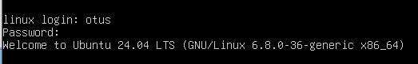

# Otus Homework 19. DHCP, PXE
### Цель домашнего задания
Отработать навыки установки и настройки DHCP, TFTP, PXE загрузчика и автоматической загрузки
### Описание домашнего задания
1. Настроить загрузку по сети дистрибутива Ubuntu 24
2. Установка должна проходить из HTTP-репозитория
3. Настроить автоматическую установку c помощью файла user-data

## Выполнение
Домашнее задание выполняется на **Vagrant** стенде с помощью **Ansible**. Vagrant создает 2 виртуальные машины: *pxeserver* и *pxeclient*. Так как *pxecleint* будет пытаться найти PXE-сервер в сети, команда *Vagrant up* завершится с ошибкой.  
Настроим pxeserver, запустив *ansible playbook*:
```bash
ansible-playbook pxe.yml
```
Результатом выполнения плэйбука будет настроенный с помощью утилиты **dnsmasq** PXE-сервер, а также DHCP и TFTP сервера.
Файлы будут отдаваться по HTTP с веб сервера apache. Установка *Ubuntu 24.04* автоматизирована.  
После этого можно перезапустить ВМ **pxeclient**. Начнется загрузка по PXE и автоматическая установка ОС. 
___
**Так как на ВМ несколько сетевых интерфейсов, загрузка ошибочно может начаться не с того адреса. В этом случае поможет перезапуск ВМ**.
___
После завершения установки, необходимо выключить ВМ и в настройках VirtualBox активировать загрузку с жесткого диска.  
Зайдем в систему с пользователем **otus** и паролем *Qwerty123*. Убедимся, что установлена верная ОС:  


